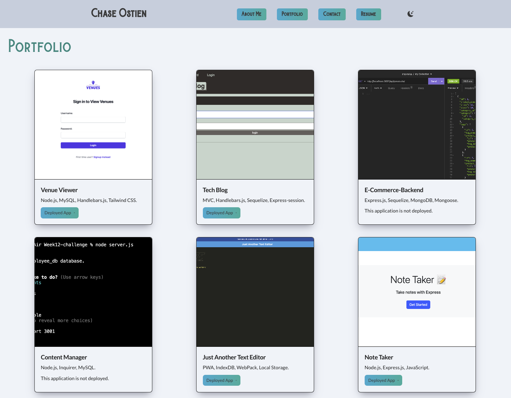

# Portfolio 


## Description
This portfolio application is a single page React app that uses conditional rendering to showcase my personal projects, allow viewers to contact me and download my resume. This application is built using Vite and React, and styled with Tailwind CSS and custom CSS. 


## Table of Contents

- [Installation](#installation)
- [Example](#example)
- [Contributors](#contributors)
- [Deploy](#deploy)
- [License](#license)
- [Questions](#questions)

## Installation

```
npm install
npm run build
npm run develop
```

## Example




## Contributors

* [Chase Ostien](https://github.com/ChaseOstien)

## Deploy

Website: 

## License

ISC License

https://opensource.org/licenses/ISC

## Questions

For additional questions, contact me at the email provided below.

- GitHub: [Portfolio](https://github.com/ChaseOstien/Portfolio)
- Netlify: [Portfolio]()
- Chaseostien@gmail.com